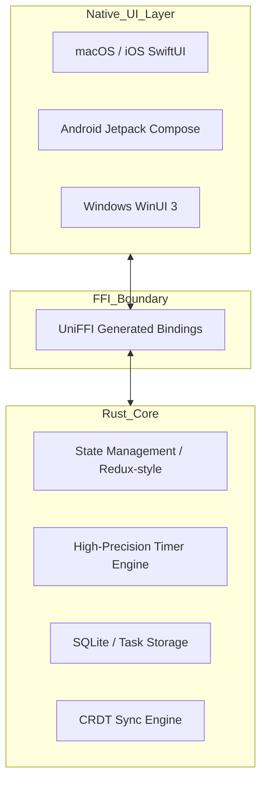

# Focus ⚛️
### A Minimalist, High-Performance, Keyboard-Centric Productivity Engine

[](https://www.rust-lang.org/)
[](https://developer.apple.com/xcode/swiftui/)
[](https://www.sqlite.org/)
[](LICENSE)

**Focus** is a cross-platform productivity application designed for deep work. It strips away the bloat of modern task managers, replacing it with a lightning-fast, native experience that prioritizes the current task and the Pomodoro timer.

Built with a **Rust Core** and **Native UI layers**, Focus offers the best of both worlds: extreme reliability and memory safety in logic, paired with the pixel-perfect responsiveness of native platforms.

---

## 🌟 Philosophy
- **Focus-First:** The timer and current task take center stage. Zero visual clutter.
- **Keyboard-Centric:** Instant task entry, navigation, and control via global shortcuts.
- **Local-First:** Immediate interactions with zero latency. No loading spinners or server delays.
- **Native Experience:** No Electron, no WebViews. Pure native performance and battery efficiency.

---

## ✨ Features
- ⏲️ **Pomodoro Timer:** Precision-engineered 25/5/15 minute sessions (customizable).
- ✅ **Task Management:** Lightning-fast task creation with one-level deep nesting (subtasks).
- 📅 **Natural Language Reminders:** "Review code tomorrow at 3pm" – parsed locally.
- 📝 **Markdown Notes:** Persistent, rich-text support for each task.
- 📊 **Visual Reports:** Minimalist daily & weekly analytics of focused hours.
- 🌐 **Ubiquitous Access:** Global hotkeys and Menu Bar / System Tray integration.
- 🔄 **Sync (Roadmap):** Lightweight CRDT-based sync for multi-device harmony.

---

## 🏗️ Architecture

Focus uses a **Shared Core Architecture** to ensure consistency across iOS, macOS, Windows, and Android while maintaining native look-and-feel.



- **UI Layer (Swift/Kotlin/C#):** Handles rendering, animations, and OS integrations (Notifications, Tray).
- **FFI Boundary (UniFFI):** Automatically generates type-safe bindings between Rust and the native languages.
- **Core Logic (Rust):** Single source of truth for business logic, timer state machine, and data persistence.

---

## 🛠️ Technology Stack
- **Business Logic:** [Rust](https://www.rust-lang.org/)
- **Frontend (Apple):** [SwiftUI](https://developer.apple.com/xcode/swiftui/)
- **Frontend (Windows):** C# / WinUI 3 (Roadmap)
- **Frontend (Android):** Kotlin / Jetpack Compose (Roadmap)
- **Local Persistence:** [SQLite](https://sqlite.org/) via `rusqlite`
- **Bindings:** [UniFFI](https://github.com/mozilla/uniffi-rs) (Mozilla)
- **CI/CD:** Multi-target compilation for Apple, Windows, and Linux.

---

## 🚀 Getting Started

### Prerequisites

- **Xcode 15+**: Required for macOS/iOS bundling and SwiftUI.
- **Rust Toolchain**: Automatically managed via the included `rust-toolchain.toml`.
- **macOS Developer Directory**: Ensure `xcode-select` is pointing to the full Xcode app.

```bash
sudo xcode-select -s /Applications/Xcode.app/Contents/Developer
sudo xcodebuild -license accept
```

### Build Instructions

1. **Clone the Repository:**
   ```bash
   git clone https://github.com/yourusername/focus-macapp.git
   cd focus-macapp
   ```

2. **Build the Rust Core & Generate Bindings:**
   The `focus-core` contains a helper script to build the XCFramework for Apple platforms.
   ```bash
   cd focus-core
   ./build_apple.sh
   ```
   *This will compile the Rust library and generate the Swift bindings in the `generated_swift/` directory.*

3. **Run the App:**
   - Open `FocusApp/FocusApp.xcodeproj` in Xcode.
   - Select your target (macOS or iOS).
   - Press **Cmd + R** to build and run.

---

## 🗺️ Roadmap

- [x] **Phase 1: Core Engine:** SQLite schema, Timer state machine, and initial UniFFI bridge.
- [x] **Phase 1.2: Design Specs:** High-fidelity documentation for all 10 priority screens.
- [ ] **Phase 2: Production Bridge:** Migration to SPM (Swift Package Manager) & Rich Notifications.
- [ ] **Phase 3: Insights:** Implementation of the Analytics dashboard and OS Widgets.
- [ ] **Phase 4: Sync:** CRDT-based background synchronization via lightweight Cloud API.
- [ ] **Phase 5: Release:** Final polish, animations, and App Store packaging.

---

## 📜 License
This project is licensed under the MIT License - see the [LICENSE](LICENSE) file for details.

---
*Created with ❤️ by Siddhant.*
